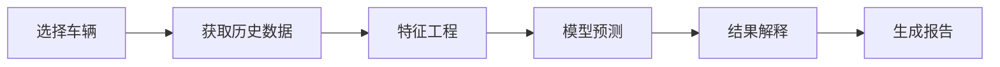
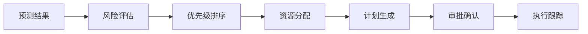

# 产品需求文档 (PRD)
# 地铁车辆磨耗智能预测系统

## 1. 项目概述

### 1.1 项目背景
地铁系统作为城市公共交通的重要组成部分，车辆的安全运营至关重要。车辆关键部件（轮对、制动系统、受电弓等）的磨耗直接影响运营安全和维护成本。传统的定期检修模式存在过度维护或维护不足的问题，需要通过智能化手段实现精准预测和优化维护。

### 1.2 项目目标
构建一个基于FastAPI的Web应用系统，通过机器学习算法对地铁车辆关键部件的磨耗进行预测，实现：
- 精准的磨耗状态评估
- 剩余寿命预测
- 智能维护计划生成
- 成本优化和风险控制

### 1.3 目标用户
- **维护工程师**：日常检修计划制定和执行
- **运营管理人员**：车队整体状况监控和资源调度
- **技术主管**：维护策略优化和成本控制
- **数据分析师**：磨耗趋势分析和模型优化

## 2. 功能需求

### 2.1 核心功能模块

#### 2.1.1 数据采集与管理
- **车辆信息管理**
  - 车辆基础信息录入（编号、型号、投运日期等）
  - 车辆运营历史记录
  - 维护记录管理

- **磨耗数据采集**
  - 手动数据录入界面
  - Excel/CSV批量导入
  - IoT传感器数据接入（预留接口）
  - 历史数据管理和查询

#### 2.1.2 磨耗预测分析
- **实时预测**
  - 单车磨耗状态评估
  - 多部件综合分析
  - 剩余寿命预测

- **批量预测**
  - 车队整体分析
  - 批量预测报告生成
  - 异常车辆识别

- **趋势分析**
  - 磨耗趋势图表
  - 影响因素分析
  - 季节性模式识别

#### 2.1.3 维护决策支持
- **维护计划生成**
  - 基于预测的维护建议
  - 优先级排序
  - 资源优化分配

- **风险评估**
  - 风险等级评定（5级）
  - 风险矩阵展示
  - 预警通知

- **成本分析**
  - 维护成本估算
  - 停运损失计算
  - ROI分析

#### 2.1.4 可视化仪表板
- **实时监控面板**
  - 车队状态总览
  - 关键指标展示
  - 实时预警信息

- **统计报表**
  - 月度/季度/年度报告
  - 自定义报表生成
  - 数据导出功能

#### 2.1.5 系统管理
- **用户管理**
  - 角色权限管理
  - 用户认证授权
  - 操作日志审计

- **配置管理**
  - 预测参数配置
  - 阈值设置
  - 通知规则配置

### 2.2 性能要求
- 响应时间：API响应 < 500ms
- 并发用户：支持100+并发用户
- 数据处理：支持百万级历史数据
- 可用性：99.9%系统可用性

### 2.3 非功能性需求
- **安全性**：数据加密、访问控制、审计日志
- **可扩展性**：微服务架构、水平扩展支持
- **易用性**：直观的UI设计、移动端适配
- **可维护性**：模块化设计、完善的文档

## 3. 数据需求

### 3.1 输入数据
- **静态数据**
  - 车辆基础信息
  - 线路信息
  - 部件规格参数

- **动态数据**
  - 运营里程
  - 载客量
  - 环境参数（温度、湿度）
  - 检测数据（磨耗值、厚度等）

### 3.2 输出数据
- 磨耗预测值
- 剩余寿命
- 风险等级
- 维护建议
- 成本估算

## 4. 技术需求

### 4.1 技术栈
- **后端**：FastAPI + Python 3.9+
- **数据库**：PostgreSQL + Redis
- **机器学习**：Scikit-learn, TensorFlow/PyTorch
- **前端**：Vue.js/React + TypeScript
- **部署**：Docker + Kubernetes
- **监控**：Prometheus + Grafana

### 4.2 接口设计
- RESTful API设计规范
- WebSocket实时通信
- GraphQL数据查询（可选）

### 4.3 数据处理
- ETL数据处理流程
- 实时流处理支持
- 数据清洗和标准化

## 5. 业务流程

### 5.1 数据录入流程

### 5.2 预测分析流程

### 5.3 维护决策流程

## 6. 用户界面

### 6.1 主要页面
1. **登录页面**：用户认证
2. **仪表板**：系统总览
3. **车辆管理**：车辆信息CRUD
4. **数据采集**：数据录入和导入
5. **预测分析**：磨耗预测操作
6. **维护计划**：维护任务管理
7. **报表中心**：统计报表查看
8. **系统设置**：配置管理

### 6.2 移动端适配
- 响应式设计
- PWA支持
- 移动端核心功能

## 7. 项目里程碑

### Phase 1：基础搭建（Week 1-2）
- 项目架构设计
- 数据库设计
- 基础API开发

### Phase 2：核心功能（Week 3-6）
- 数据管理模块
- 预测算法集成
- 基础UI开发

### Phase 3：高级功能（Week 7-10）
- 可视化仪表板
- 报表系统
- 权限管理

### Phase 4：优化部署（Week 11-12）
- 性能优化
- 安全加固
- 部署上线

## 8. 风险评估

### 8.1 技术风险
- 预测模型准确性
- 系统性能瓶颈
- 数据安全问题

### 8.2 业务风险
- 用户接受度
- 数据质量问题
- 维护成本

### 8.3 缓解措施
- 持续模型优化
- 性能监控和优化
- 用户培训计划
- 数据质量控制

## 9. 成功指标

### 9.1 技术指标
- 预测准确率 > 90%
- 系统响应时间 < 500ms
- 系统可用性 > 99.9%

### 9.2 业务指标
- 维护成本降低 20%
- 故障率降低 30%
- 用户满意度 > 85%

## 10. 附录

### 10.1 术语表
- **磨耗**：部件因使用产生的材料损失
- **轮对**：车轮和车轴的组合
- **受电弓**：从接触网获取电能的装置
- **镟修**：轮对修复工艺

### 10.2 参考资料
- 地铁车辆维护标准
- 机器学习预测模型文献
- FastAPI官方文档

### 10.3 更新记录
- 2024-01-26：初始版本创建
- 待更新...